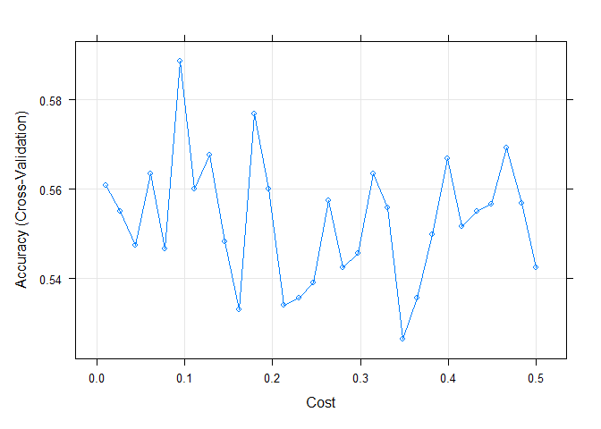

Assignment 7
================
Chee Kay Cheong
2023-02-29

``` r
knitr::opts_chunk$set(message = FALSE, warning = FALSE)

library(tidyverse)
library(caret)
library(glmnet)
library(gbm) 
library(rpart.plot) # tree plots
library(rpart) # CaRT
library(e1071) # SVM 
```

Do 5-folds cv instead of 10-folds because the outcome is so so so small
(only 159 outcomes)

## Load and clean dataset

``` r
# Load and clean dataset
admission = read_csv("./Data/mi.data.csv") %>% 
  janitor::clean_names() %>% 
  select(-id) %>% 
  mutate(readmission = as_factor(readmission),
         readmission = fct_recode(readmission, 'No' = '0', 'Yes' = '1'))
  
# Identify any rows that do not have complete cases (i.e. have missing data)
miss.rows = admission[!complete.cases(admission), ]
# No missing values detected.

# Set 'No readmission' as reference Level
admission$readmission = relevel(admission$readmission, ref = "No")

# Check data distribution
summary(admission)
```

    ##       age             sex             sodium           alt        
    ##  Min.   :26.00   Min.   :0.0000   Min.   :117.0   Min.   :0.0300  
    ##  1st Qu.:54.00   1st Qu.:0.0000   1st Qu.:133.0   1st Qu.:0.2300  
    ##  Median :63.00   Median :1.0000   Median :136.0   Median :0.3800  
    ##  Mean   :61.87   Mean   :0.6282   Mean   :136.6   Mean   :0.4736  
    ##  3rd Qu.:70.00   3rd Qu.:1.0000   3rd Qu.:140.0   3rd Qu.:0.6100  
    ##  Max.   :92.00   Max.   :2.0000   Max.   :169.0   Max.   :3.0000  
    ##       wbc              esr              sbp             dbp       
    ##  Min.   : 2.000   Min.   :  1.00   Min.   :  0.0   Min.   :  0.0  
    ##  1st Qu.: 6.400   1st Qu.:  5.00   1st Qu.:120.0   1st Qu.: 70.0  
    ##  Median : 8.000   Median : 10.00   Median :140.0   Median : 80.0  
    ##  Mean   : 8.804   Mean   : 13.48   Mean   :138.8   Mean   : 82.1  
    ##  3rd Qu.:10.500   3rd Qu.: 19.00   3rd Qu.:160.0   3rd Qu.: 90.0  
    ##  Max.   :27.900   Max.   :140.00   Max.   :260.0   Max.   :190.0  
    ##    pulm_adema            fc             arr               diab       
    ##  Min.   :0.00000   Min.   :0.000   Min.   :0.00000   Min.   :0.0000  
    ##  1st Qu.:0.00000   1st Qu.:0.000   1st Qu.:0.00000   1st Qu.:0.0000  
    ##  Median :0.00000   Median :2.000   Median :0.00000   Median :0.0000  
    ##  Mean   :0.06529   Mean   :1.216   Mean   :0.02471   Mean   :0.1341  
    ##  3rd Qu.:0.00000   3rd Qu.:2.000   3rd Qu.:0.00000   3rd Qu.:0.0000  
    ##  Max.   :1.00000   Max.   :4.000   Max.   :1.00000   Max.   :1.0000  
    ##     obesity            asthma        readmission
    ##  Min.   :0.00000   Min.   :0.00000   No :1541   
    ##  1st Qu.:0.00000   1st Qu.:0.00000   Yes: 159   
    ##  Median :0.00000   Median :0.00000              
    ##  Mean   :0.02471   Mean   :0.02235              
    ##  3rd Qu.:0.00000   3rd Qu.:0.00000              
    ##  Max.   :1.00000   Max.   :1.00000

``` r
# Readmission: Yes = 159, No = 1541 (Very unbalanced)
```

## Data Partitioning

Partition the data into training and testing using a 70/30 split.

``` r
set.seed(123)

training.index = 
  admission$readmission %>% 
  createDataPartition(p = 0.7, list = FALSE)

training = admission[training.index, ]
testing = admission[-training.index, ]

# I want to see if I have enough outcomes in my training dataset and if I should do "up" or "down" sample.
training %>% 
  select(readmission) %>% 
  group_by(readmission) %>% 
  count()
```

    ## # A tibble: 2 × 2
    ## # Groups:   readmission [2]
    ##   readmission     n
    ##   <fct>       <int>
    ## 1 No           1079
    ## 2 Yes           112

## Construct 3 prediction models, choose hyperparameters, and compare performance

### RIDGE

``` r
set.seed(123)

lambda.grid = expand.grid(alpha = 0, lambda = seq(1, 115))

control.settings = trainControl(method = "cv", number = 5, sampling = "up")

ridge = train(readmission ~ ., data = training, method = "glmnet", preProc = c("center", "scale"), trControl = control.settings, tuneGrid = lambda.grid)

# Find best tuned parameters
ridge$bestTune
```

    ##     alpha lambda
    ## 115     0    115

``` r
# alpha = 0, lambda = 115
ridge$results
```

    ##     alpha lambda  Accuracy        Kappa AccuracySD     KappaSD
    ## 1       0      1 0.6044977  0.065074582 0.02980895 0.071712970
    ## 2       0      2 0.6078485  0.067542146 0.03380498 0.075860272
    ## 3       0      3 0.6095327  0.074695339 0.03640294 0.076663565
    ## 4       0      4 0.6103695  0.075419101 0.03813185 0.078159834
    ## 5       0      5 0.6128905  0.080373497 0.03967909 0.077780776
    ## 6       0      6 0.6137309  0.084052773 0.03995974 0.076781369
    ## 7       0      7 0.6137309  0.084052773 0.03995974 0.076781369
    ## 8       0      8 0.6137309  0.084052773 0.03995974 0.076781369
    ## 9       0      9 0.6137309  0.084052773 0.03995974 0.076781369
    ## 10      0     10 0.6145712  0.084506253 0.03921636 0.076652223
    ## 11      0     11 0.6145712  0.084506253 0.03921636 0.076652223
    ## 12      0     12 0.6120572  0.083302103 0.04177639 0.077854290
    ## 13      0     13 0.6120572  0.083302103 0.04177639 0.077854290
    ## 14      0     14 0.6112134  0.082826199 0.04214315 0.077930640
    ## 15      0     15 0.6112134  0.082826199 0.04214315 0.077930640
    ## 16      0     16 0.6112134  0.082826199 0.04214315 0.077930640
    ## 17      0     17 0.6112134  0.082826199 0.04214315 0.077930640
    ## 18      0     18 0.6120537  0.083279679 0.04150272 0.077812338
    ## 19      0     19 0.6120537  0.083279679 0.04150272 0.077812338
    ## 20      0     20 0.6120537  0.083279679 0.04150272 0.077812338
    ## 21      0     21 0.6120537  0.083279679 0.04150272 0.077812338
    ## 22      0     22 0.6120537  0.083279679 0.04150272 0.077812338
    ## 23      0     23 0.6120537  0.083279679 0.04150272 0.077812338
    ## 24      0     24 0.6120537  0.083279679 0.04150272 0.077812338
    ## 25      0     25 0.6120537  0.083279679 0.04150272 0.077812338
    ## 26      0     26 0.6120537  0.083279679 0.04150272 0.077812338
    ## 27      0     27 0.6120537  0.083279679 0.04150272 0.077812338
    ## 28      0     28 0.6120537  0.083279679 0.04150272 0.077812338
    ## 29      0     29 0.6120537  0.083279679 0.04150272 0.077812338
    ## 30      0     30 0.6120537  0.083279679 0.04150272 0.077812338
    ## 31      0     31 0.6120537  0.083279679 0.04150272 0.077812338
    ## 32      0     32 0.6120537  0.083279679 0.04150272 0.077812338
    ## 33      0     33 0.6120537  0.083279679 0.04150272 0.077812338
    ## 34      0     34 0.6120537  0.083279679 0.04150272 0.077812338
    ## 35      0     35 0.6120537  0.083279679 0.04150272 0.077812338
    ## 36      0     36 0.6120537  0.083279679 0.04150272 0.077812338
    ## 37      0     37 0.6120537  0.083279679 0.04150272 0.077812338
    ## 38      0     38 0.6120537  0.083279679 0.04150272 0.077812338
    ## 39      0     39 0.6120537  0.083279679 0.04150272 0.077812338
    ## 40      0     40 0.6120537  0.083279679 0.04150272 0.077812338
    ## 41      0     41 0.6120537  0.083279679 0.04150272 0.077812338
    ## 42      0     42 0.6120537  0.083279679 0.04150272 0.077812338
    ## 43      0     43 0.6120537  0.083279679 0.04150272 0.077812338
    ## 44      0     44 0.6120537  0.083279679 0.04150272 0.077812338
    ## 45      0     45 0.6120537  0.083279679 0.04150272 0.077812338
    ## 46      0     46 0.6120537  0.083279679 0.04150272 0.077812338
    ## 47      0     47 0.6120537  0.083279679 0.04150272 0.077812338
    ## 48      0     48 0.6120537  0.083279679 0.04150272 0.077812338
    ## 49      0     49 0.6120537  0.083279679 0.04150272 0.077812338
    ## 50      0     50 0.6120537  0.083279679 0.04150272 0.077812338
    ## 51      0     51 0.6120537  0.083279679 0.04150272 0.077812338
    ## 52      0     52 0.6120537  0.083279679 0.04150272 0.077812338
    ## 53      0     53 0.6120537  0.083279679 0.04150272 0.077812338
    ## 54      0     54 0.6120537  0.083279679 0.04150272 0.077812338
    ## 55      0     55 0.6120537  0.083279679 0.04150272 0.077812338
    ## 56      0     56 0.6120537  0.083279679 0.04150272 0.077812338
    ## 57      0     57 0.6120537  0.083279679 0.04150272 0.077812338
    ## 58      0     58 0.6120537  0.083279679 0.04150272 0.077812338
    ## 59      0     59 0.6120537  0.083279679 0.04150272 0.077812338
    ## 60      0     60 0.6120537  0.083279679 0.04150272 0.077812338
    ## 61      0     61 0.6120537  0.083279679 0.04150272 0.077812338
    ## 62      0     62 0.6120537  0.083279679 0.04150272 0.077812338
    ## 63      0     63 0.6120537  0.083279679 0.04150272 0.077812338
    ## 64      0     64 0.6120537  0.083279679 0.04150272 0.077812338
    ## 65      0     65 0.6120537  0.083279679 0.04150272 0.077812338
    ## 66      0     66 0.6120537  0.083279679 0.04150272 0.077812338
    ## 67      0     67 0.6120537  0.083279679 0.04150272 0.077812338
    ## 68      0     68 0.6120537  0.083279679 0.04150272 0.077812338
    ## 69      0     69 0.6120537  0.083279679 0.04150272 0.077812338
    ## 70      0     70 0.6120537  0.083279679 0.04150272 0.077812338
    ## 71      0     71 0.6120537  0.083279679 0.04150272 0.077812338
    ## 72      0     72 0.6120537  0.083279679 0.04150272 0.077812338
    ## 73      0     73 0.6120537  0.083279679 0.04150272 0.077812338
    ## 74      0     74 0.6120537  0.083279679 0.04150272 0.077812338
    ## 75      0     75 0.6572420  0.041564632 0.13914931 0.041093922
    ## 76      0     76 0.6572420  0.041564632 0.13914931 0.041093922
    ## 77      0     77 0.6572420  0.041564632 0.13914931 0.041093922
    ## 78      0     78 0.6572420  0.041564632 0.13914931 0.041093922
    ## 79      0     79 0.6572420  0.041564632 0.13914931 0.041093922
    ## 80      0     80 0.6572420  0.041564632 0.13914931 0.041093922
    ## 81      0     81 0.5568200  0.027189173 0.29227966 0.040405240
    ## 82      0     82 0.5568200  0.027189173 0.29227966 0.040405240
    ## 83      0     83 0.6131226  0.012265625 0.33319946 0.031251219
    ## 84      0     84 0.6131226  0.012265625 0.33319946 0.031251219
    ## 85      0     85 0.6131226  0.012265625 0.33319946 0.031251219
    ## 86      0     86 0.6131226  0.012265625 0.33319946 0.031251219
    ## 87      0     87 0.6131226  0.012265625 0.33319946 0.031251219
    ## 88      0     88 0.6131226  0.012265625 0.33319946 0.031251219
    ## 89      0     89 0.6131226  0.012265625 0.33319946 0.031251219
    ## 90      0     90 0.6131226  0.012265625 0.33319946 0.031251219
    ## 91      0     91 0.6131226  0.012265625 0.33319946 0.031251219
    ## 92      0     92 0.6131226  0.012265625 0.33319946 0.031251219
    ## 93      0     93 0.6131226  0.012265625 0.33319946 0.031251219
    ## 94      0     94 0.6131226  0.012265625 0.33319946 0.031251219
    ## 95      0     95 0.6131226  0.012265625 0.33319946 0.031251219
    ## 96      0     96 0.6131226  0.012265625 0.33319946 0.031251219
    ## 97      0     97 0.6131226  0.012265625 0.33319946 0.031251219
    ## 98      0     98 0.6131226  0.012265625 0.33319946 0.031251219
    ## 99      0     99 0.6131226  0.012265625 0.33319946 0.031251219
    ## 100     0    100 0.6131226  0.012265625 0.33319946 0.031251219
    ## 101     0    101 0.6131226  0.012265625 0.33319946 0.031251219
    ## 102     0    102 0.6131226  0.012265625 0.33319946 0.031251219
    ## 103     0    103 0.6769881 -0.001321331 0.35699065 0.002954586
    ## 104     0    104 0.6769881 -0.001321331 0.35699065 0.002954586
    ## 105     0    105 0.6769881 -0.001321331 0.35699065 0.002954586
    ## 106     0    106 0.6769881 -0.001321331 0.35699065 0.002954586
    ## 107     0    107 0.6769881 -0.001321331 0.35699065 0.002954586
    ## 108     0    108 0.6769881 -0.001321331 0.35699065 0.002954586
    ## 109     0    109 0.6769881 -0.001321331 0.35699065 0.002954586
    ## 110     0    110 0.6769881 -0.001321331 0.35699065 0.002954586
    ## 111     0    111 0.6769881 -0.001321331 0.35699065 0.002954586
    ## 112     0    112 0.6769881 -0.001321331 0.35699065 0.002954586
    ## 113     0    113 0.6769881 -0.001321331 0.35699065 0.002954586
    ## 114     0    114 0.7430969  0.000000000 0.36351687 0.000000000
    ## 115     0    115 0.7430969  0.000000000 0.36351687 0.000000000

``` r
# Highest accuracy = 0.7430969

# Check performance
confusionMatrix(ridge)
```

    ## Cross-Validated (5 fold) Confusion Matrix 
    ## 
    ## (entries are percentual average cell counts across resamples)
    ##  
    ##           Reference
    ## Prediction   No  Yes
    ##        No  72.5  7.6
    ##        Yes 18.1  1.8
    ##                             
    ##  Accuracy (average) : 0.7439

``` r
# Average accuracy = 0.7439
# Only 1.8% of the data is correctly classified as those who are "Yes readmission" have been predicted as "Yes".
# 18.1% of the data is misclassified as those who are "No readmission" have been incorrectly predicted as "Yes". 
# 7.6% of the data is missclassified as those who are "Yes readmission" have been incorrectlt predicted as "No".

# Check variable importance
varImp(ridge)
```

    ## glmnet variable importance
    ## 
    ##            Overall
    ## dbp        100.000
    ## sbp         97.576
    ## fc          83.057
    ## age         62.888
    ## sex         54.285
    ## diab        42.941
    ## wbc         34.785
    ## pulm_adema  30.667
    ## arr         30.009
    ## obesity     26.788
    ## asthma       8.670
    ## sodium       6.592
    ## alt          1.276
    ## esr          0.000

``` r
coef(ridge$finalModel, ridge$bestTune$lambda)
```

    ## 15 x 1 sparse Matrix of class "dgCMatrix"
    ##                        s1
    ## (Intercept) -2.363561e-15
    ## age          5.798898e-38
    ## sex         -5.046773e-38
    ## sodium       8.769750e-39
    ## alt         -4.122232e-39
    ## wbc          3.341909e-38
    ## esr          3.006817e-39
    ## sbp          8.831620e-38
    ## dbp          9.043557e-38
    ## pulm_adema  -2.981879e-38
    ## fc           7.562269e-38
    ## arr         -2.924364e-38
    ## diab         4.054947e-38
    ## obesity      2.642720e-38
    ## asthma       1.058692e-38

### Support Vector Classifier

``` r
set.seed(123)

tune_grid = expand.grid(C = seq(0.01, 0.5, length = 30))

control.settings = trainControl(method = "cv", number = 5, sampling = "up")

svm.model = train(readmission ~ ., data = training, method = "svmLinear", trControl = control.settings, preProcess = c("center", "scale"), tuneGrid = tune_grid)

# Visualize accuracy versus values of C
plot(svm.model)
```

<!-- -->

``` r
#See information about final model
svm.model$results
```

    ##             C  Accuracy      Kappa AccuracySD    KappaSD
    ## 1  0.01000000 0.5608457 0.05895508 0.01868921 0.03916588
    ## 2  0.02689655 0.5550055 0.05864090 0.03036691 0.03314998
    ## 3  0.04379310 0.5474496 0.05925719 0.04879711 0.04315560
    ## 4  0.06068966 0.5633806 0.06635317 0.02539994 0.05115741
    ## 5  0.07758621 0.5466094 0.05557242 0.05603075 0.06533128
    ## 6  0.09448276 0.5885946 0.06519405 0.02199239 0.04231946
    ## 7  0.11137931 0.5600651 0.05286350 0.02954002 0.02674838
    ## 8  0.12827586 0.5676214 0.06471940 0.03911577 0.05779873
    ## 9  0.14517241 0.5482508 0.04541739 0.03145192 0.04757626
    ## 10 0.16206897 0.5331777 0.05294449 0.03912763 0.03012024
    ## 11 0.17896552 0.5767803 0.04746096 0.02862865 0.07219376
    ## 12 0.19586207 0.5600688 0.04034460 0.02749971 0.05987211
    ## 13 0.21275862 0.5340677 0.04038502 0.03932073 0.04916745
    ## 14 0.22965517 0.5357341 0.04687180 0.04201046 0.03295414
    ## 15 0.24655172 0.5390705 0.04169442 0.02611289 0.02927307
    ## 16 0.26344828 0.5575194 0.06241821 0.03046060 0.04368481
    ## 17 0.28034483 0.5424252 0.04714067 0.03766688 0.04851695
    ## 18 0.29724138 0.5457370 0.03881316 0.02413729 0.05705848
    ## 19 0.31413793 0.5634372 0.05114375 0.02015843 0.04224721
    ## 20 0.33103448 0.5558460 0.03915763 0.02908460 0.03853859
    ## 21 0.34793103 0.5265115 0.04259317 0.04483267 0.02676233
    ## 22 0.36482759 0.5356953 0.03336492 0.03292692 0.04024153
    ## 23 0.38172414 0.5499211 0.05630947 0.03685817 0.05584584
    ## 24 0.39862069 0.5667773 0.06125565 0.02883866 0.03386060
    ## 25 0.41551724 0.5516619 0.04666973 0.04265817 0.03789334
    ## 26 0.43241379 0.5549775 0.04355154 0.04524775 0.04064681
    ## 27 0.44931034 0.5567004 0.04248741 0.02245385 0.03633573
    ## 28 0.46620690 0.5692102 0.05544631 0.04186678 0.05895762
    ## 29 0.48310345 0.5567709 0.03932045 0.03776638 0.04287786
    ## 30 0.50000000 0.5424003 0.04990506 0.04502947 0.04160168

``` r
svm.model$finalModel
```

    ## Support Vector Machine object of class "ksvm" 
    ## 
    ## SV type: C-svc  (classification) 
    ##  parameter : cost C = 0.0944827586206896 
    ## 
    ## Linear (vanilla) kernel function. 
    ## 
    ## Number of Support Vectors : 1813 
    ## 
    ## Objective Function Value : -169.8458 
    ## Training error : 0.385079

``` r
# C = 0.0945, Highest Accuracy = 0.5886

# Check performance
confusionMatrix(svm.model)
```

    ## Cross-Validated (5 fold) Confusion Matrix 
    ## 
    ## (entries are percentual average cell counts across resamples)
    ##  
    ##           Reference
    ## Prediction   No  Yes
    ##        No  53.4  3.9
    ##        Yes 37.2  5.5
    ##                             
    ##  Accuracy (average) : 0.5886

``` r
# Average accuracy = 0.5693
# 5.5% of the data were correctly classified as those who are "Yes readmission" were classified as "Yes".
# 37.2% of the data were misclassified as those who are "No readmission" were classified as "Yes".

# varImp(svm.model) doesn't work with SVM model. Professor said no need to fix this before this assignment is due.
```

### Ensemble Method with Bagging

``` r
set.seed(123)

# We need to take out the outcome variable "Readmission" from the predictors pool.
mtry.val = expand.grid(.mtry = ncol(training)-1)

control.settings = trainControl(method = "cv", number = 5, sampling = "up")

# Start with 100 trees.
bag.100 = train(readmission ~ ., data = training, method = "rf", metric = "Accuracy", tuneGrid = mtry.val, ntree = 100, trControl = control.settings)

bag.100$results 
```

    ##   mtry  Accuracy       Kappa AccuracySD    KappaSD
    ## 1   14 0.8782524 -0.02099542 0.01070702 0.03374267

``` r
# Accuracy = 0.8783
confusionMatrix(bag.100)
```

    ## Cross-Validated (5 fold) Confusion Matrix 
    ## 
    ## (entries are percentual average cell counts across resamples)
    ##  
    ##           Reference
    ## Prediction   No  Yes
    ##        No  87.7  9.2
    ##        Yes  2.9  0.2
    ##                             
    ##  Accuracy (average) : 0.8783

``` r
# 0.2% correctly classified as those who are "Yes readmission" were classified as "Yes"
# 2.9% misclassified as those who are "No readmission" were classified as "Yes"
# 9.2% misclassified as those who are "Yes readmission" were classified as "No"
varImp(bag.100)
```

    ## rf variable importance
    ## 
    ##             Overall
    ## wbc        100.0000
    ## age         89.6510
    ## sodium      72.2286
    ## esr         72.1960
    ## alt         61.6480
    ## sbp         60.5070
    ## dbp         35.9421
    ## fc          22.2161
    ## sex         10.4565
    ## diab         7.0074
    ## pulm_adema   3.1496
    ## obesity      1.7864
    ## arr          0.7473
    ## asthma       0.0000

``` r
# Try 200 trees
bag.200 = train(readmission ~ ., data = training, method = "rf", metric = "Accuracy", tuneGrid = mtry.val, ntree = 200, trControl = control.settings)

bag.200$results
```

    ##   mtry  Accuracy      Kappa AccuracySD    KappaSD
    ## 1   14 0.8883267 0.01741512 0.01283749 0.04445388

``` r
# Accuracy = 0.8883
confusionMatrix(bag.200)
```

    ## Cross-Validated (5 fold) Confusion Matrix 
    ## 
    ## (entries are percentual average cell counts across resamples)
    ##  
    ##           Reference
    ## Prediction   No  Yes
    ##        No  88.5  9.1
    ##        Yes  2.1  0.3
    ##                             
    ##  Accuracy (average) : 0.8883

``` r
# 0.3% correctly classified as those who are "Yes readmission" were classified as "Yes"
# 2.1% misclassified as those who are "No readmission" were classified as "Yes"
# 9.1% misclassified as those who are "Yes readmission" were classified as "No"
varImp(bag.200)
```

    ## rf variable importance
    ## 
    ##            Overall
    ## wbc        100.000
    ## age         80.567
    ## esr         69.224
    ## sodium      63.415
    ## alt         57.855
    ## sbp         52.383
    ## dbp         37.413
    ## fc          20.611
    ## sex         10.429
    ## diab         5.621
    ## pulm_adema   3.286
    ## obesity      2.645
    ## arr          1.180
    ## asthma       0.000

## Choose the “best” model

I have performed Accuracy Test to compare performance of all three
models. The Support Vector Classifier (SVM) model gives us the lowest
accuracy among all three models, and it does not work with `varImp()` in
`Caret`, which then I cannot look at the variable importance for this
model. So I decided not to consider this model.

Between the Ridge and Bagging models, I decided to choose the **Bagging
model** because the Bagging model has a higher accuracy than the Ridge
model.

## Apply model to test set and calculate evaluation metrics

I decided to use **Confusion Matrix** as the evaluation metrics for the
test set because I don’t know how to interpret an ROC curve.

``` r
set.seed(123)

# Make predictions in test set
bag.pred.test = predict(bag.200, testing)

# Get evaluation metrics from test set
confusionMatrix(bag.pred.test, testing$readmission, positive = "Yes")
```

    ## Confusion Matrix and Statistics
    ## 
    ##           Reference
    ## Prediction  No Yes
    ##        No  447  45
    ##        Yes  15   2
    ##                                           
    ##                Accuracy : 0.8821          
    ##                  95% CI : (0.8509, 0.9088)
    ##     No Information Rate : 0.9077          
    ##     P-Value [Acc > NIR] : 0.9776407       
    ##                                           
    ##                   Kappa : 0.0141          
    ##                                           
    ##  Mcnemar's Test P-Value : 0.0001812       
    ##                                           
    ##             Sensitivity : 0.042553        
    ##             Specificity : 0.967532        
    ##          Pos Pred Value : 0.117647        
    ##          Neg Pred Value : 0.908537        
    ##              Prevalence : 0.092338        
    ##          Detection Rate : 0.003929        
    ##    Detection Prevalence : 0.033399        
    ##       Balanced Accuracy : 0.505043        
    ##                                           
    ##        'Positive' Class : Yes             
    ## 

``` r
# Check variable importance
varImp(bag.200)
```

    ## rf variable importance
    ## 
    ##            Overall
    ## wbc        100.000
    ## age         80.567
    ## esr         69.224
    ## sodium      63.415
    ## alt         57.855
    ## sbp         52.383
    ## dbp         37.413
    ## fc          20.611
    ## sex         10.429
    ## diab         5.621
    ## pulm_adema   3.286
    ## obesity      2.645
    ## arr          1.180
    ## asthma       0.000

Based on the Confusion Matrix, the Ensemble method with Bagging model
has an accuracy of 0.8821 (95% CI = 0.8509, 0.9088), with a sensitivity
of 0.04 and a specificity of 0.97. The proportion of false negative is
quite high because the positive predictive value is very low (0.12).

According to the final model (“Bag.200”), the predictor “wbc” is the
most important variable (100%) to predict readmission, followed by “age”
(80.57%), “esr” (69.22%), “sodium” (63.42%), “alt” (57.85%), and so on.
